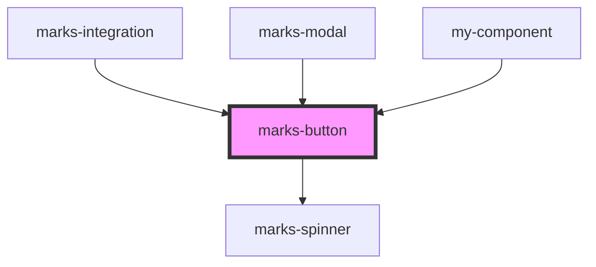

# marks-button

<!-- Auto Generated Below -->

## Properties

| Property     | Attribute    | Description | Type      | Default     |
| ------------ | ------------ | ----------- | --------- | ----------- |
| `appearance` | `appearance` |             | `string`  | `undefined` |
| `loader`     | `loader`     |             | `boolean` | `undefined` |
| `text`       | `text`       |             | `string`  | `undefined` |

## Dependencies

### Used by

 - [marks-integration](../marks-integration)
 - [marks-modal](../marks-modal)
 - [my-component](../my-component)

### Depends on

- [marks-spinner](../marks-spinner)

### Graph

----------------------------------------------

*Built with [StencilJS](https://stenciljs.com/)*
