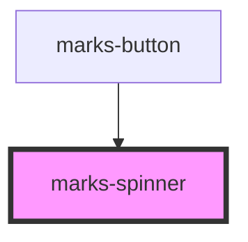

# marks-spinner

<!-- Auto Generated Below -->

## Properties

| Property | Attribute | Description | Type  | Default     |
| -------- | --------- | ----------- | ----- | ----------- |
| `color`  | `color`   |             | `any` | `'grey'`    |
| `type`   | `type`    |             | `any` | `'android'` |

## Dependencies

### Used by

 - [marks-button](../marks-button)

### Graph

----------------------------------------------

*Built with [StencilJS](https://stenciljs.com/)*
